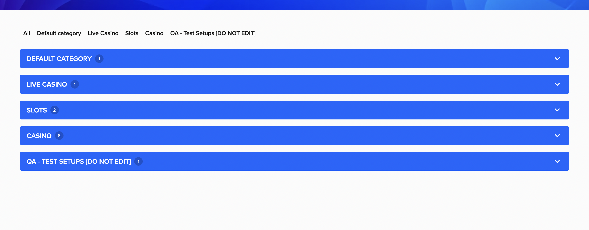
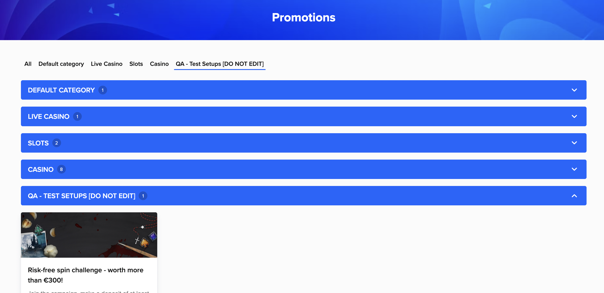
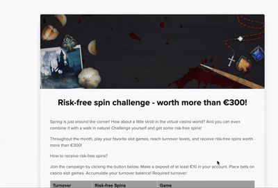
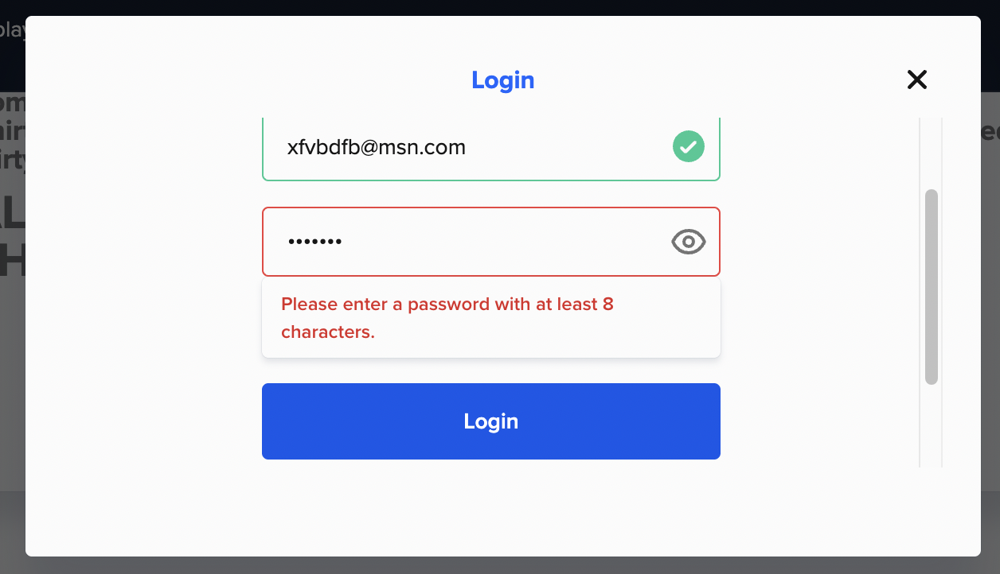

# Exploratory Testing Session Report

## Session Information

| Session # | Features     | App Ver | Tools          | Duration |
|-----------|--------------|---------|----------------|----------|
| 0001      | - Promotions | 0.0.1   | - Chrome v134  | 45 min.  |

## Findings
- ### Relevant Flows
  [Feature file](Promotions.feature)
  - T001: View Promotions
  - T002: View promotion categories
  - T003: View a promotion details
  - T004: Opt in to a promotion

- ### UX Improvements
  - The **Accordeon component** of the Promotions page consumes too much visual area when it is colapsed. The user should scroll across irrelevant colapsed categories before to see relevant promotions of the filtered Category.
  
  

  - The **Promotion boxes** within categories have animation on mouse hover but none interaction on click. When a web element is highlighted on mouse hover usually it means the element has interaction. It is advised when clicking on a promotion box redirect to Promotion details.
  

  - The **Read More button** within Promotion box can have a secondary color. It is advised to have a normalized visual language to avoid user mistakes.
  

  - The **Opt In button** in the Promotion Details page is accesible after scroll down till to bottom of the page . it is advised to fix the button in main area and stay float regarding the scroll so that the user can click whenever.
  

- ### Potencial Risks
  - Avoid providing feedback about password format. Just throw the 'Incorrect credentials' generic message skipping the Login http transaction.
  

- ### Bugs
  None functional issues were found on the session.